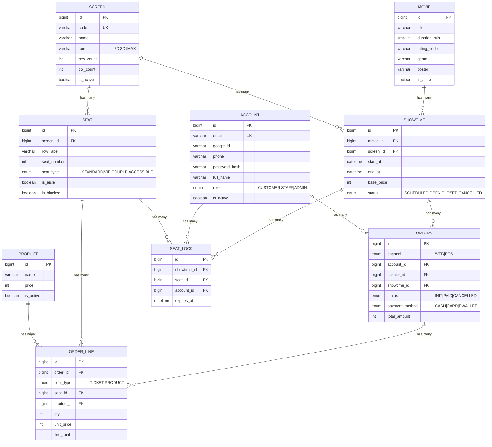
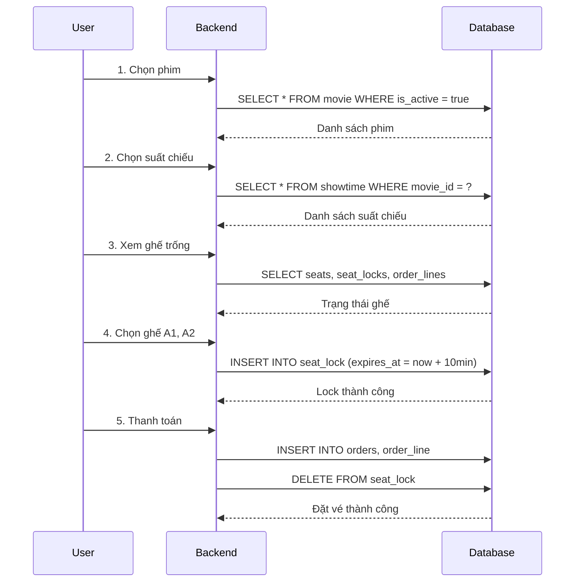

# Database ERD - Cinema Service

## Sơ đồ quan hệ Entity-Relationship



---

## Chi tiết Foreign Keys

| Table | Column | References | On Update | On Delete |
|-------|--------|------------|-----------|-----------|
| `showtime` | `movie_id` | `movie.id` | CASCADE | RESTRICT |
| `showtime` | `screen_id` | `screen.id` | CASCADE | RESTRICT |
| `seat` | `screen_id` | `screen.id` | CASCADE | CASCADE |
| `orders` | `account_id` | `account.id` | CASCADE | SET NULL |
| `orders` | `showtime_id` | `showtime.id` | CASCADE | RESTRICT |
| `order_line` | `order_id` | `orders.id` | CASCADE | CASCADE |
| `order_line` | `product_id` | `product.id` | CASCADE | RESTRICT |
| `order_line` | `seat_id` | `seat.id` | CASCADE | RESTRICT |
| `seat_lock` | `seat_id` | `seat.id` | CASCADE | CASCADE |
| `seat_lock` | `showtime_id` | `showtime.id` | CASCADE | CASCADE |
| `seat_lock` | `account_id` | `account.id` | CASCADE | SET NULL |

---

## Giải thích On Delete

| Action | Ý nghĩa |
|--------|---------|
| `CASCADE` | Xóa parent → Tự động xóa tất cả children |
| `RESTRICT` | Không cho xóa parent nếu còn children |
| `SET NULL` | Xóa parent → Set foreign key = NULL |

---

## Logic nghiệp vụ

### 1. Movie → Showtime (1:N)
```
Một phim có nhiều suất chiếu
Không thể xóa phim nếu còn suất chiếu (RESTRICT)
```

### 2. Screen → Seat (1:N)
```
Một phòng chiếu có nhiều ghế
Xóa phòng chiếu → Xóa tất cả ghế (CASCADE)
```

### 3. Screen → Showtime (1:N)
```
Một phòng có nhiều suất chiếu
Không thể xóa phòng nếu còn suất chiếu (RESTRICT)
```

### 4. Showtime → Order (1:N)
```
Một suất chiếu có nhiều đơn hàng
Không thể xóa suất chiếu nếu còn đơn hàng (RESTRICT)
```

### 5. Order → OrderLine (1:N)
```
Một đơn hàng có nhiều dòng chi tiết
Xóa đơn hàng → Xóa tất cả chi tiết (CASCADE)
```

### 6. Account → Order (1:N)
```
Một tài khoản có nhiều đơn hàng
Xóa tài khoản → Order.account_id = NULL (SET NULL)
```

### 7. Showtime + Seat → SeatLock
```
Khóa ghế tạm thời khi user đang chọn ghế
Unique: (showtime_id, seat_id) - Mỗi ghế chỉ khóa 1 lần cho 1 suất
```

---

## Flow đặt vé


