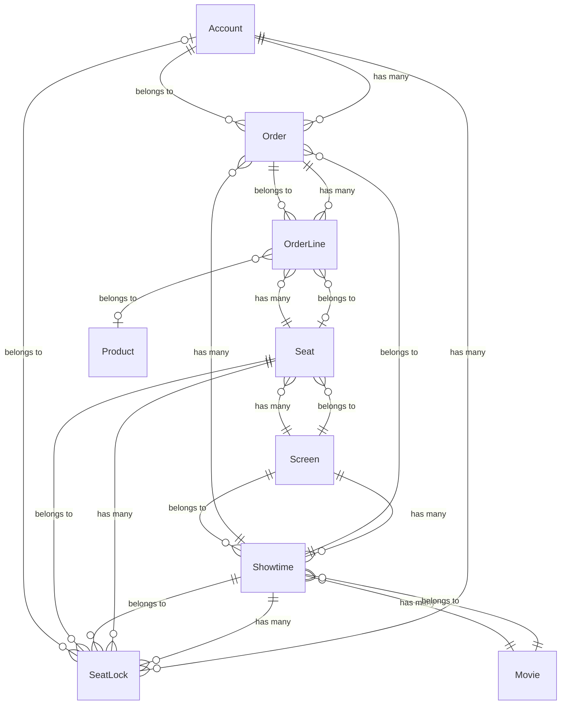

# Eloquent Relationships - Cinema Service

## Tổng quan

Tài liệu này mô tả tất cả các mối quan hệ (relationships) giữa các Model trong dự án Cinema Service.

---

## Sơ đồ quan hệ tổng thể



---

## Các loại Relationship trong Laravel

| Loại | Mô tả | Ví dụ |
|------|-------|-------|
| `hasOne` | Quan hệ 1-1 | User có 1 Profile |
| `hasMany` | Quan hệ 1-nhiều | Movie có nhiều Showtime |
| `belongsTo` | Quan hệ ngược của hasOne/hasMany | Showtime thuộc về Movie |
| `belongsToMany` | Quan hệ nhiều-nhiều | User có nhiều Role |
| `hasOneThrough` | 1-1 qua bảng trung gian | - |
| `hasManyThrough` | 1-nhiều qua bảng trung gian | - |

---

## Chi tiết từng Model

### 1. Movie (Phim)

**File:** `app/Models/Movie.php`

| Relationship | Method | Loại | Model liên quan | Foreign Key |
|--------------|--------|------|-----------------|-------------|
| Suất chiếu | `showtimes()` | `hasMany` | Showtime | `movie_id` |

```php
// Một phim có nhiều suất chiếu
public function showtimes()
{
    return $this->hasMany(Showtime::class);
}
```

**Cách sử dụng:**
```php
$movie = Movie::find(1);
$showtimes = $movie->showtimes;  // Collection of Showtime
```

---

### 2. Showtime (Suất chiếu)

**File:** `app/Models/Showtime.php`

| Relationship | Method | Loại | Model liên quan | Foreign Key |
|--------------|--------|------|-----------------|-------------|
| Phim | `movie()` | `belongsTo` | Movie | `movie_id` |
| Phòng chiếu | `screen()` | `belongsTo` | Screen | `screen_id` |
| Đơn hàng | `orders()` | `hasMany` | Order | `showtime_id` |
| Khóa ghế | `seat_locks()` | `hasMany` | SeatLock | `showtime_id` |

```php
// Suất chiếu thuộc về một phim
public function movie()
{
    return $this->belongsTo(Movie::class);
}

// Suất chiếu thuộc về một phòng chiếu
public function screen()
{
    return $this->belongsTo(Screen::class);
}

// Suất chiếu có nhiều đơn hàng
public function orders()
{
    return $this->hasMany(Order::class);
}

// Suất chiếu có nhiều khóa ghế tạm thời
public function seat_locks()
{
    return $this->hasMany(SeatLock::class);
}
```

---

### 3. Screen (Phòng chiếu)

**File:** `app/Models/Screen.php`

| Relationship | Method | Loại | Model liên quan | Foreign Key |
|--------------|--------|------|-----------------|-------------|
| Ghế | `seats()` | `hasMany` | Seat | `screen_id` |
| Suất chiếu | `showtimes()` | `hasMany` | Showtime | `screen_id` |

```php
// Phòng chiếu có nhiều ghế
public function seats()
{
    return $this->hasMany(Seat::class);
}

// Phòng chiếu có nhiều suất chiếu
public function showtimes()
{
    return $this->hasMany(Showtime::class);
}
```

---

### 4. Seat (Ghế)

**File:** `app/Models/Seat.php`

| Relationship | Method | Loại | Model liên quan | Foreign Key |
|--------------|--------|------|-----------------|-------------|
| Phòng chiếu | `screen()` | `belongsTo` | Screen | `screen_id` |
| Chi tiết đơn | `order_lines()` | `hasMany` | OrderLine | `seat_id` |
| Khóa ghế | `seat_locks()` | `hasMany` | SeatLock | `seat_id` |

```php
// Ghế thuộc về một phòng chiếu
public function screen()
{
    return $this->belongsTo(Screen::class);
}

// Ghế có nhiều chi tiết đơn hàng (lịch sử đặt)
public function order_lines()
{
    return $this->hasMany(OrderLine::class);
}

// Ghế có nhiều khóa tạm thời
public function seat_locks()
{
    return $this->hasMany(SeatLock::class);
}
```

---

### 5. Account (Tài khoản)

**File:** `app/Models/Account.php`

| Relationship | Method | Loại | Model liên quan | Foreign Key |
|--------------|--------|------|-----------------|-------------|
| Đơn hàng | `orders()` | `hasMany` | Order | `account_id` |
| Khóa ghế | `seat_locks()` | `hasMany` | SeatLock | `account_id` |

```php
// Tài khoản có nhiều đơn hàng
public function orders()
{
    return $this->hasMany(Order::class);
}

// Tài khoản có nhiều khóa ghế
public function seat_locks()
{
    return $this->hasMany(SeatLock::class);
}
```

---

### 6. Order (Đơn hàng)

**File:** `app/Models/Order.php`

| Relationship | Method | Loại | Model liên quan | Foreign Key |
|--------------|--------|------|-----------------|-------------|
| Tài khoản | `account()` | `belongsTo` | Account | `account_id` |
| Suất chiếu | `showtime()` | `belongsTo` | Showtime | `showtime_id` |
| Chi tiết đơn | `order_lines()` | `hasMany` | OrderLine | `order_id` |

```php
// Đơn hàng thuộc về tài khoản
public function account()
{
    return $this->belongsTo(Account::class);
}

// Đơn hàng thuộc về suất chiếu
public function showtime()
{
    return $this->belongsTo(Showtime::class);
}

// Đơn hàng có nhiều chi tiết
public function order_lines()
{
    return $this->hasMany(OrderLine::class);
}
```

---

### 7. OrderLine (Chi tiết đơn hàng)

**File:** `app/Models/OrderLine.php`

| Relationship | Method | Loại | Model liên quan | Foreign Key |
|--------------|--------|------|-----------------|-------------|
| Đơn hàng | `order()` | `belongsTo` | Order | `order_id` |
| Sản phẩm | `product()` | `belongsTo` | Product | `product_id` |
| Ghế | `seat()` | `belongsTo` | Seat | `seat_id` |

```php
// Chi tiết thuộc về đơn hàng
public function order()
{
    return $this->belongsTo(Order::class);
}

// Chi tiết có thể liên kết với sản phẩm (bắp, nước)
public function product()
{
    return $this->belongsTo(Product::class);
}

// Chi tiết có thể liên kết với ghế (vé)
public function seat()
{
    return $this->belongsTo(Seat::class);
}
```

---

### 8. SeatLock (Khóa ghế tạm thời)

**File:** `app/Models/SeatLock.php`

| Relationship | Method | Loại | Model liên quan | Foreign Key |
|--------------|--------|------|-----------------|-------------|
| Ghế | `seat()` | `belongsTo` | Seat | `seat_id` |
| Suất chiếu | `showtime()` | `belongsTo` | Showtime | `showtime_id` |
| Tài khoản | `account()` | `belongsTo` | Account | `account_id` |

```php
public function seat()
{
    return $this->belongsTo(Seat::class);
}

public function showtime()
{
    return $this->belongsTo(Showtime::class);
}

public function account()
{
    return $this->belongsTo(Account::class);
}
```

---

## Eager Loading (Tải trước dữ liệu)

Để tránh N+1 query problem, sử dụng `with()`:

```php
// ❌ N+1 Problem
$showtimes = Showtime::all();
foreach ($showtimes as $showtime) {
    echo $showtime->movie->title;  // 1 query cho mỗi showtime
}

// ✅ Eager Loading
$showtimes = Showtime::with(['movie', 'screen'])->get();
foreach ($showtimes as $showtime) {
    echo $showtime->movie->title;  // Đã load sẵn, không query thêm
}
```

---

## Ví dụ thực tế

### Lấy tất cả suất chiếu của một phim với thông tin phòng chiếu

```php
$movie = Movie::with('showtimes.screen')->find(1);

foreach ($movie->showtimes as $showtime) {
    echo "Phòng: " . $showtime->screen->name;
    echo "Giờ: " . $showtime->start_at;
}
```

### Lấy đơn hàng với đầy đủ thông tin

```php
$order = Order::with([
    'account',
    'showtime.movie',
    'showtime.screen',
    'order_lines.seat',
    'order_lines.product'
])->find(1);
```

### Đếm số suất chiếu của mỗi phim

```php
$movies = Movie::withCount('showtimes')->get();

foreach ($movies as $movie) {
    echo $movie->title . ": " . $movie->showtimes_count . " suất";
}
```
